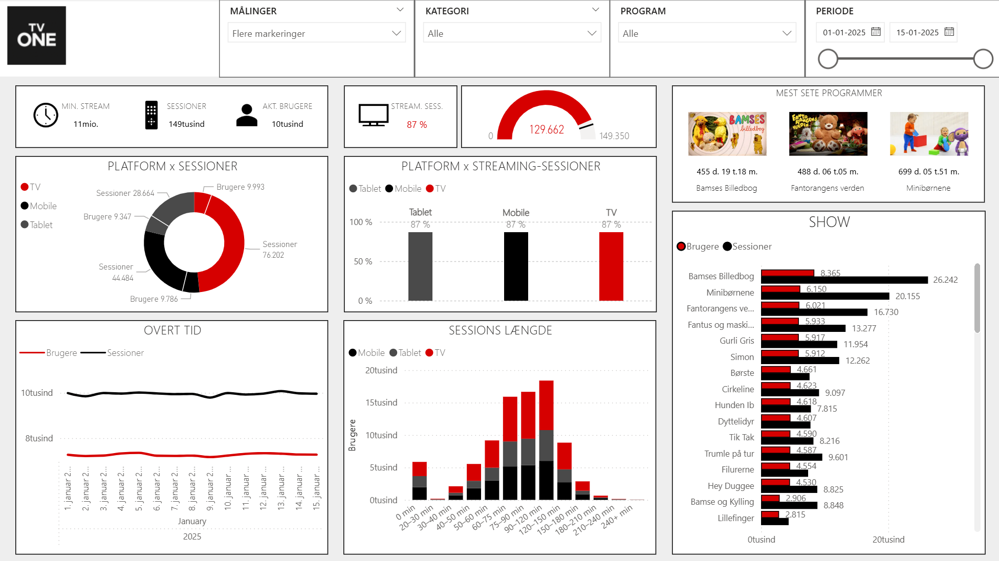

# TVONE Dokumentation

Denne mappe samler den lokale dokumentation for den udtraekke TVONE-loesning.



## Indhold

- `README.md`
  dokumentationsoversigt for den standalone repo

## Formaal

TVONE er et data- og rapporteringsprojekt, der viser hele floewet fra kildefiler til Power BI:

- JSON-baseret metadata for programmer, saesoner og episoder
- simulerede bruger- og trackingdata
- SQL- og dbt-baseret modellering i PostgreSQL
- semantisk model og Tabular Editor-scripts til rapportering

## Struktur

```text
TVONE/
|-- docs/
|-- res/
|   |-- json/
|   `-- pbi/
|-- src/
|   |-- code/
|   |   |-- libraries/
|   |   |-- runtime_definitions/
|   |   `-- service/
|   `-- workspace-serve/
`-- README.md
```

## Centrale mapper

- `src/code/runtime_definitions/`
  runtime-filer til JSON-load, simulation og SQL-jobs
- `src/code/service/etl/`
  de koerbare ETL-services
- `src/code/service/dbt/`
  staging- og marts-modeller til rapportlaget
- `src/workspace-serve/SemanticModel/`
  PBIP-projektet og den semantiske model
- `src/workspace-serve/Tabular/`
  scripts og DAX-assets til Tabular Editor

## Links

- [Tilbage til projektets README](../README.md)
- [Tabular-oversigt](../src/workspace-serve/Tabular/README.md)
